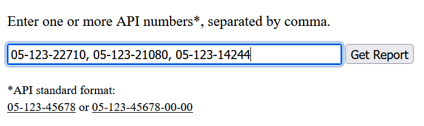

# HBP Web App

A web application for checking for periods of time during which oil
wells or gas wells ceased producing, to help determine whether an oil
and gas lease remains "Held By Production" (or simply "HBP").


## Why?

Borrowing the following explanation from a write-up I did for a 
[related project](https://github.com/JamesPImes/og_production_analyzer)
(which is also used in this project):

> An "oil and gas lease" is a contract between a landowner and an oil company
that lays out the terms for the company to drill wells on the land, the
royalties they must pay to the landowner, etc.
> 
> A typical lease is negotiated to last a specific period of time (e.g., 1 year,
5 years, whatever gets negotiated) -- __and then to continue indefinitely,
for as long as oil and/or gas are produced from one or more wells on the
leased lands.__
Without consistent production, the lease will automatically terminate.
The lease will often specify just how consistent the production must be
-- commonly allowing up to 90 consecutive days before expiration.
It might also specify the *quantity* of oil or gas to be produced in order
to extend the lease indefinitely. If sufficient production resumes soon
enough, the termination timer is reset to 90 days (or whatever was
negotiated).
> 
> However, it is not always obvious to either party when production has
ceased and a lease has terminated -- especially when there are many wells
to check, multiple leases to keep track of, and decades have passed.
(When a lease termination isn't noticed, the company may need to negotiate
some sort of resolution or face litigation, if production is resumed late
or new wells are drilled without a valid lease in place -- and those risks
and penalties may compound as time goes on.)

In short, if all of the relevant wells cease producing oil or gas during
the same period of time, a lease might terminate if that cessation lasts
long enough. This web application analyzes the publicly available
production records for the requested wells and reports any such periods
of zero production and the duration of each.


# To deploy locally...

### Option 1 - Docker

1) `git clone <this repo>`
2) `docker-compose up --build`

This option does not require installing MongoDB locally or setting up a 
cloud instance, but it becomes tricky to have the database persist if 
the Docker image needs to be rebuilt. That said, the database is only 
used to cache of free public records anyway, so that might not be an 
issue.

### Option 2

If you want more control over the database (e.g., if you want to use a 
cloud instance of MongoDB; or if you want easier persistence), you might
want to go this route:

1) `git clone <this repo>`
2) `pip install -r requirements.txt`
3) Locally install [MongoDB](https://www.mongodb.com/try/download/community)
or set up a cloud instance. \*\*
4) Copy `.env.example` to `.env` and configure however you want. \*\*
5) Run `app.py`

\*\* The default `.env.example` is configured for a very basic, 
unsecured local database. In production, we would want to change `.env`
to configure MongoDB Cloud, etc.


# Usage Guide and API Endpoints

The production gaps for a collection of wells can be obtained as either
a text-based report or in JSON format.

*(Note that "API number" refers to a unique well ID that adheres to the 
__American Petroleum Institute__'s format. It's unfortunate but 
unavoidable that the same acronym has two meanings here.)*

### Get a text report of all production gaps

The main page will generate a 
[static HTML report](https://htmlpreview.github.io/?https://github.com/JamesPImes/hbp_webapp/blob/master/_example_resources/sample_report.htm) 
for the requested wells, showing the gaps in production (one version 
where wells in "shut-in" status are considered to be producing even when
they are not, and another version where the status of wells does not 
matter).

This report can be obtained in either of two ways:

* __Option #1__ - Enter well numbers in the web app



* __Option #2__ - Use the `/well_group_report?api_nums=<...>` 
endpoint

Well numbers are separated by comma, as in the following example (in a
local deployment):

```
http://127.0.0.1:5000/well_group_report?api_nums=05-123-22710,05-123-21080,05-123-14244
```

### Get production gaps and well data as JSON

To get the same information (plus some additional detail) 
[in JSON format](_example_resources/sample_json.json),
use the `/well_group/` endpoint, separating well numbers by comma:

```
http://127.0.0.1:5000/well_group/05-123-22710,05-123-21080,05-123-14244
```
